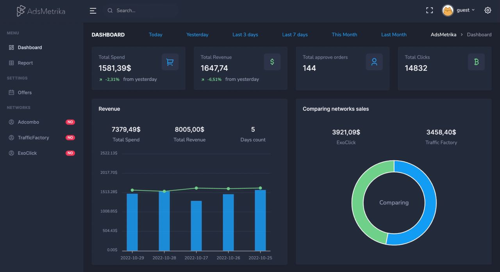
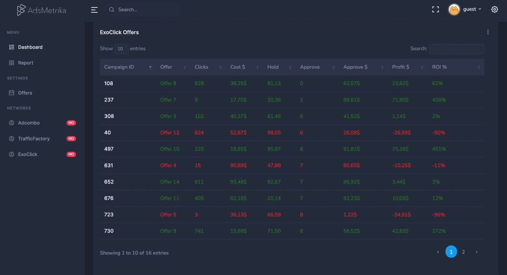

# AdsMetrika

End-to-end analytics service for media buyers. Combines statistics from advertising networks 
<a href="trafficfactory.com">trafficfactory.com</a> and <a href="https://exoclick.com">exoclick.com</a> 
with a partner network <a href="https://adcombo.com">adcombo.com</a>

* <strong>Daily statistics</strong>

* <strong>Offer statistics</strong>

<h3>Example</h3>
<a href="http://146.19.170.159:8080/">AdsMetrika link</a>

<strong>Credentials:</strong>
 Username: guest
 Password: 123

# Usage

<ul>
<li>1. Unpack <strong>/main/src/main/resources/static.zip</strong></li>
<li>2. Create PostgreSQL DB <strong>ads_metrika_db</strong> UTF8 encoding</li>
<li>3. Fill in <strong>application.properties</strong> </li>
<li>4. Execute <strong>PopulateDB.sql</strong> </li>

</ul>

